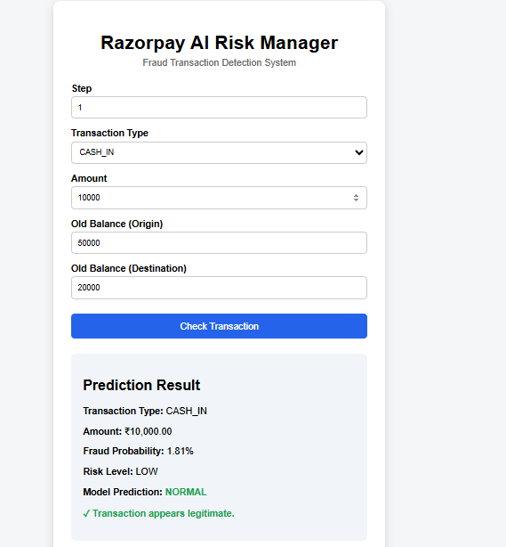

# 💳 Razorpay AI Risk Manager


## AI-Based Fraud Transaction Detection System

## 📌 Project Overview

Razorpay AI Risk Manager is a machine learning-based web application designed to detect potentially fraudulent financial transactions.

The system accepts transaction details from the user, performs feature engineering, and uses a trained machine learning classification model to predict whether a transaction is **NORMAL** or **FRAUD**.

The application also calculates the fraud probability and assigns a corresponding risk level:

- 🟢 **LOW**
- 🟡 **MEDIUM**
- 🔴 **HIGH**

The project demonstrates the practical application of Artificial Intelligence and Machine Learning to financial transaction risk analysis.

---

## ✨ Features

- 🤖 AI/ML-based fraud detection
- 🔍 Transaction risk analysis
- 📊 Fraud probability calculation
- 🚨 LOW / MEDIUM / HIGH risk classification
- 🌐 Flask-based web application
- 🧠 Machine learning classification model
- ⚙️ Feature engineering
- 💻 Simple and user-friendly interface
- 🔐 Financial transaction risk assessment
- 📈 Model-based prediction

---

## 🔄 System Workflow

```text
                User
                  │
                  ▼
       Enter Transaction Details
                  │
                  ▼
        Flask Web Application
                  │
                  ▼
          Input Processing
                  │
                  ▼
        Feature Engineering
                  │
                  ▼
       Trained ML Model
                  │
                  ▼
       Fraud Probability
                  │
                  ▼
          Risk Assessment
                  │
                  ▼
       ┌──────────┴──────────┐
       │                     │
    NORMAL                 FRAUD
       │                     │
       └──────────┬──────────┘
                  ▼
        Display Result